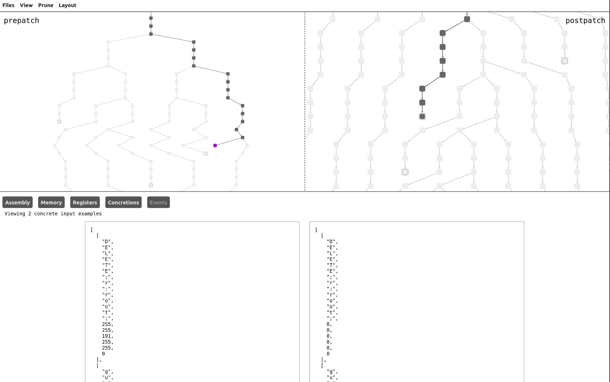

# cozy (Comparative Symbolic Evaluation)

cozy is a symbolic execution framework built around angr to enable comparative evaluation.
The goal of comparative evaluation is to determine the precise changes made by software
patches, specifically micropatches. cozy is capable of reporting observable changes
made by a micropatch, specifically to registers, memory and stdout/stderr. The framework
has the ability to dump diff information in both a textual human-readable report and
via a browser based rich user interface.



## Install

cozy is now available as a Python package on PyPI under the name `cozy-re`. Install with pip via the following command:

```commandline
pip install cozy-re
```

## Documentation

The getting started guide and API reference can be found on our Github pages!:

https://draperlaboratory.github.io/cozy/

## About

cozy is being developed by Draper Laboratory under the [DARPA Assured Micropatching (AMP) program](https://www.darpa.mil/program/assured-micropatching).

## Build Instructions

To get started with building cozy, run the following commands in the project root folder to create a virtual environment and install angr:

```commandline
python3 -m venv venv
source venv/bin/activate
pip3 install angr sphinx sphinx-autoapi networkx claripy portion
```

Alternatively, if you have `nix` installed and flakes enabled, run

``` 
nix develop .#testing 
```

To enter a nix development shell with `cozy` and its dependencies available on
`$PYTHONPATH`.

## Testing

To run an example comparison, run one of the example scripts. In the root directory, run the following commands:

```commandline
source venv/bin/activate
export PYTHONPATH="${PYTHONPATH}:$PWD"
python3 examples/cmp_null_deref.py
```

Or just `python3 examples/cmp_null_deref.py` if you're in the nix development
shell.

### Building Docs

Building the docs requires the use of sphinx and sphinx-autoapi, which you should have previously installed via pip3. To build fresh HTML docs, run the following:

```commandline
source venv/bin/activate
cd docs
make html
```

The output documents should be stored in docs/build/html