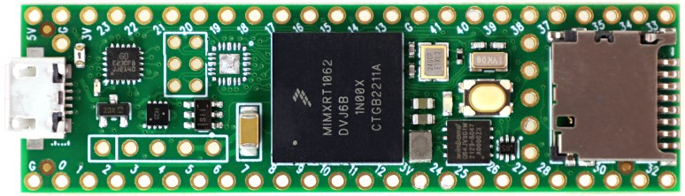
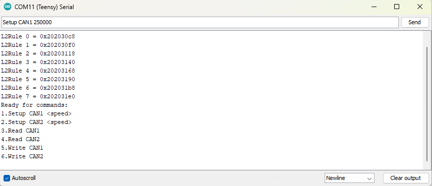

# AMP_Chal_IDPS
AMP Challenge for Spring 2024 Hackathon

## Overview
The previous ARM-based IDPS had a race condition bug which was solved during the Fall 2023 hackathon. Since then a lot more functionality has been added to the system. The system now accepts serial commands to do a lot of the setup which was previously hard-coded. This unfortunately has a unchecked buffer which suseptible to overflow and crash the system.

## Repository Structure

- **`/src`**: Source Code
- **`/build`**: Binaries

## System Overview
The IDPS was implemented on a [Teensy 4.1 USB Development Board](https://www.pjrc.com/store/teensy41.html) based on an ARM Cortex M7 MCU.



The IDPS system accepts a host of serial commands for initial setup and some utilities. It has an LED indicator on the board that stays 'ON' all the time.




The serial commands are queued in a fixed-length buffer for processing.

## Bug
The serial commands are stored in the buffer without any checks and the system resets if a sufficiently long command is sent.
```
if (Serial.available()) {
    
    char inChar = Serial.read();
    if (inChar == '\n' || inChar == '\r') {
      if (bufferPosition > 0) {
        inputBuffer[bufferPosition] = '\0'; 
        Serial.print("Command received: ");
        Serial.println(inputBuffer);
        process_command(inputBuffer);
        bufferPosition = 0;
      }
    } 
    
    else{
      inputBuffer[bufferPosition++] = inChar;
    }
```

## Possible Patch
Insert a check before storing any data in the buffer:
```
if (bufferPosition > BUFFER_SIZE - 1 ) {
          bufferPosition = 0;
          memset(inputBuffer, 0, BUFFER_SIZE);
          return;
```

Does this solve the problem entirely?

***Checking the buffer size before adding to the buffer prevents this buffer from overflowing. There is also the Serial buffer....*** 
