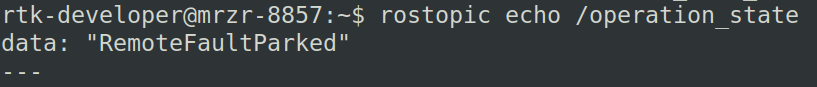
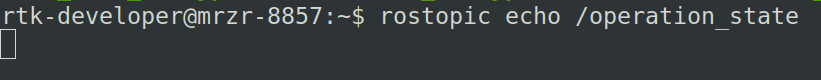
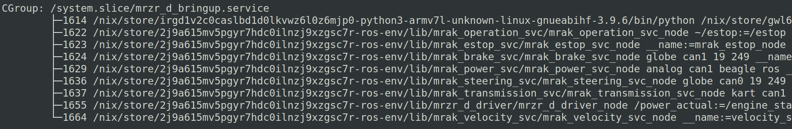

# Introduction 

According to the [ROS homepage](https://www.ros.org/), 
> The Robot Operating System (ROS) is a set of software libraries and tools that help you build robot applications. From drivers to state-of-the-art algorithms, and with powerful developer tools, ROS has what you need for your next robotics project. And it's all open source.

For this challenge, we are interested in looking at the binaries and libraries that compose the Vehicle Interface Controller (VIC). The VIC acts as an intermediary between an Ethernet network exchanging messages, and the Conroller Area Network (CAN) bus. It is a key component of the MRZR platform used by the Ground Vehicle Systems Center (GVSC), and leverages the open-source ROS, allowing for remote control and inspection of the vehicle.

The VIC is a component developed and provided by Applied Research Associates, Inc (ARA). While GVSC makes use of the VIC, any issues that may arise with it require interaction with ARA, which may delay mission-critical changes. Ability to patch and verify the system while changes go through the official pipeline may prove to be the best solution.

For this challenge, the VIC has been replicated on the BeagleBone Black boards that we have been using throughout AMP. It has the Sitara AM3358BZCZ100 processor which is a Cortex-A8 implementation.

Nearly all of the programs that run for the required service providing VIC support, are dynamic ELF binaries. They use shared libraries. The code for at least the ROS libraries are open-source, and can be found in [this repository](https://github.com/ros/ros_comm).

This is the first challenge that must patch and verify a system library, which may present its own challenges.


# Issue

The shared system library "libroscpp.so" is used by the ELF binaries when the MRZR service node is *active*. This is one of the libraries involved in the deserialization process of the serialized ROS messages. When deserializing from any binary (via libroscpp.so), there is a check to be sure the specified length of the message to be deserialized is under 1000000000 (1e9 or 0x3b9aca00) bytes. If the interpreted size is greater than this number bytes, the established connection will be purposefully dropped by the binary that is subscribed to the topic to which the message has been published. 

Unfortunately for the VIC, there is a window between the maximum system memory on the underlying platform and the 1e9 byte limit before dropping a connection. If a size is specified within this range, the program raises a SIGABRT signal, terminating the process which is receiving the serialized message. This is an OK scenario for most of the binaries; it will likely cause a restart of the process! "mrak_operation_svc_node" however was not configured to restart.

Cross compilation for this library is non-trivial and would need to assure that any proprietary modifications to the library remain in the library. A much faster route would be the ability to patch the logic surrounding and inclusive of this check.

# In action

The commandline utility on the VIC (or an appropriately setup host environment), `rostopic`, can be used to subscibe, publish, and query a particular topic within the pub-sub ROS framework. In the image below, we are logged into the master node on the MRZR and are subscribing to the '/operation_state' topic in order to print the current state of the vehicle and any updates. 


After running the attack, we get no response from the query. 

This happens due to the mrak_operation_svc_node being the "/operation_state" publisher. When it goes offline, that topic is no longer being published by any nodes on the network.

Logging into the VIC replacement we setup, a query about the status of the mrzr_d_bringup service shows all of the expected processes pre-attack.


Post-attack, one can see the missing 'mrak_operation_svc_node' process is no longer alive, and two other processes have respawned with new process ids.


# Files

The binaries of interest for this challenge are found in bin/ of this directory. They can also be found on the running VIC at various locations (due to NixOS). 

On the VIC, libroscpp.so is found at "/nix/store/b0d2rj6p775a1jp00r9xpy6mph2dv2s3-ros-melodic-roscpp-armv7l-unknown-linux-gnueabihf-1.14.11-r1/lib/libroscpp.so"

# Location

The C++ code for this issue can be found by inspection of the source files for libroscpp.so. The function "TransportPublisherLink::onMessageLength" contains the check for the specified length to be at or under 1e9 bytes. It is found at "ros_comm/clients/roscpp/src/libros/transport_publisher_link.cpp" within the source repository.

```C++
    //...
    if (len > 1000000000)
    {
      ROS_ERROR("a message of over a gigabyte was " \
                  "predicted in tcpros. that seems highly " \
                  "unlikely, so I'll assume protocol " \
                  "synchronization is lost.");
      drop();
      return;
    }
    //...
```

# Solution

One solution to this problem is to check the system for total memory in order to avoid the SIGABRT, and drop the connection if the length is above this value.This should get rid of the crashable length window.

# Patch

A potential patch with an off-by-one error:

```C
  //...
  // Use Linux system call to get total memory
  struct sysinfo info;
  sysinfo(&info);
  if (len > info.totalram) {
    ROS_ERROR("......");
    drop();
  }
  // Continue execution
  //...
```

Another potential using C++, again with the off-by-one error:

```C++
  // Define checking function
  unsigned char lenok(uint32_t len) {
      std::string tok;
      std::ifstream file("/proc/meminfo");
      while(file >> tok) {
          if(tok == "MemTotal:") {
              unsigned long memtot;
              if(file >> memtot) {
                if (len > memtot*1024) {
                  return 0;
                }
              }
          }
      }
      return 1; 
  }

  // ...
  if (!lenok(len)) {
    ROS_ERROR("......");
    drop();
  }
  // Continue execution
  // ...
```

A hopefully perfect patch:

```C
  //...
  // Use Linux system call to get total memory
  struct sysinfo info;
  sysinfo(&info);
  if (len >= info.totalram) {
    ROS_ERROR("......");
    drop();
  }
  // Continue execution
  //...
```

# Extra

There is a systemd service, mrzr_d_bringup.service, started by the operating system which controls the launching of these binaries.

For testing, there is a script at /home/ara/amp_vic_test.sh on the VIC for performing simple tests.

There is a manually patched version of the libroscpp.so library at bin/libroscpp_manually_patched.so for testing before the hackathon. 
